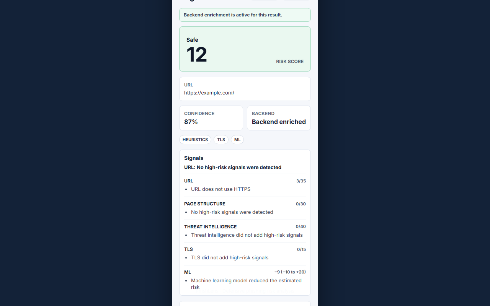
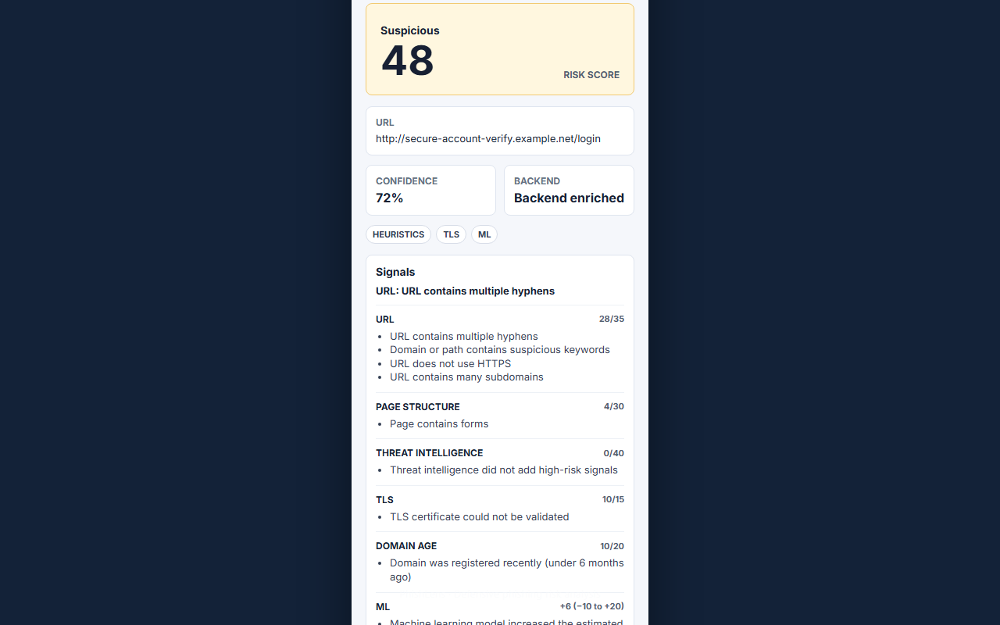
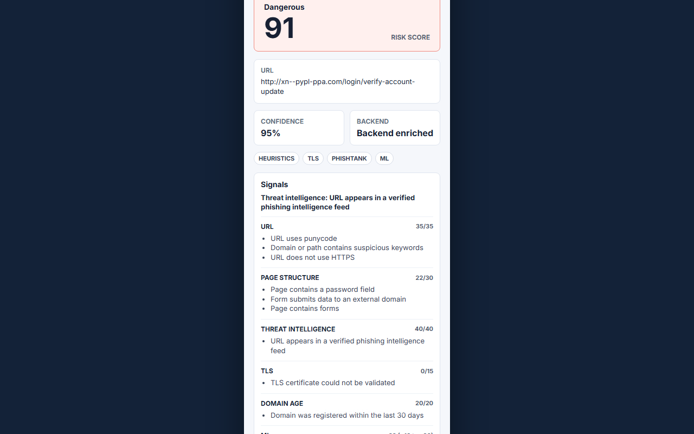
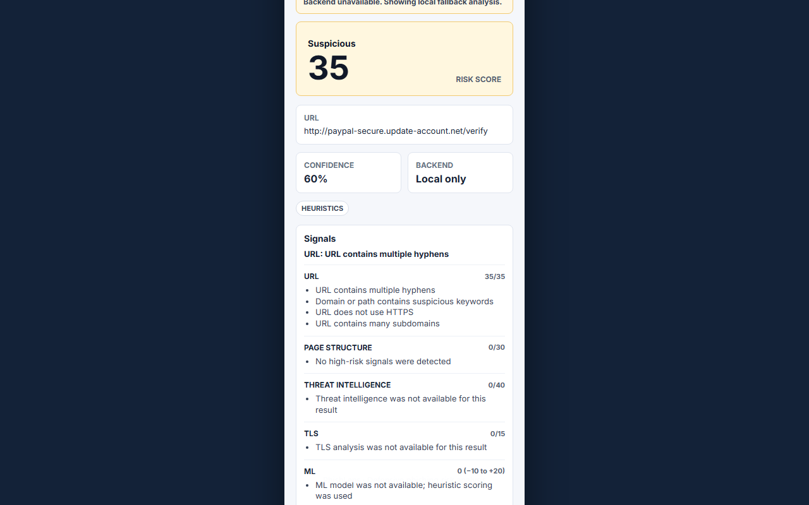
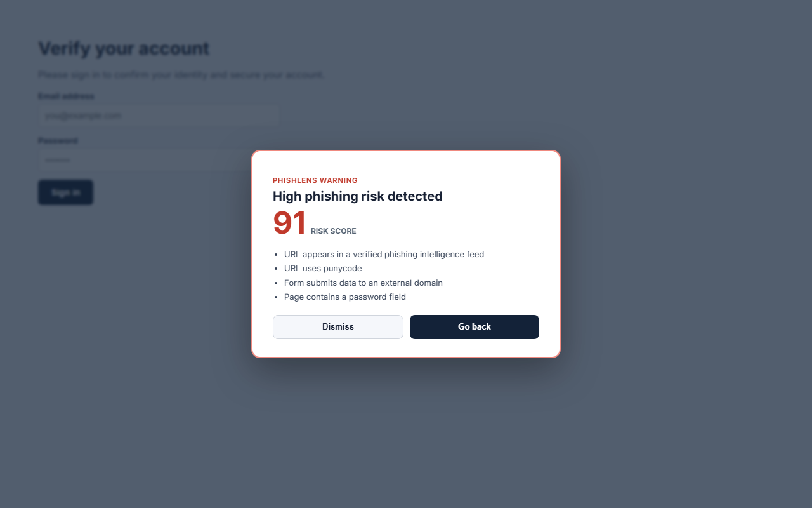

# PhishLens

[](https://github.com/JuanCardesa/PhishLens/actions/workflows/backend-ci.yml)
[](https://github.com/JuanCardesa/PhishLens/actions/workflows/extension-ci.yml)
[](https://github.com/JuanCardesa/PhishLens/actions/workflows/security-ci.yml)
[](https://codecov.io/gh/JuanCardesa/PhishLens)

**[Project site](https://juancardesa.github.io/PhishLens/)** · [Architecture](docs/architecture.md) · [Privacy policy](docs/privacy.md) · [Threat model](docs/threat-model.md) · [ML methodology](docs/ml-methodology.md) · [Demo script](docs/demo-script.md)

PhishLens is a defensive Chrome extension and FastAPI backend for explainable phishing risk analysis in real time.

It combines local URL heuristics, privacy-preserving DOM signals, optional PhishTank threat intelligence, backend-side TLS certificate inspection, and an optional machine learning model. The project is built as a practical cybersecurity portfolio project with clear safety boundaries.

## Quick Start

```bash
# 1. Clone and set up the backend
git clone https://github.com/JuanCardesa/PhishLens.git && cd PhishLens
cp .env.example .env
python -m venv .venv && source .venv/bin/activate  # Windows: .venv\Scripts\activate
pip install -r backend/requirements-dev.txt

# 2. Start the backend
uvicorn app.main:app --app-dir backend --reload

# 3. Build the extension
cd extension && npm install && npm run build

# 4. Load the extension in Chrome: chrome://extensions → Developer mode → Load unpacked → select extension/dist

# 5. (Optional) Build a real ML dataset and retrain the model
python ml/datasets/build_dataset.py && python ml/train_model.py
```

## Current Status

Implemented product capabilities:

- Chrome Extension Manifest V3 with React popup.
- Local URL and DOM heuristic analysis.
- Options page for backend URL, timeout, and dangerous overlay settings.
- User feedback reporting from the popup to `/report`.
- Informative, dismissible overlay for `dangerous` results.
- FastAPI backend with `/health`, `/analyze`, and `/report`.
- PhishTank integration prepared through environment variables.
- TLS inspection implemented in the backend.
- URL normalization and in-memory TTL cache for PhishTank and TLS checks.
- Demo ML training and evaluation pipeline.
- Docker Compose and GitHub Actions workflows.
- Privacy, threat model, architecture, ML methodology, and roadmap docs.
- Reproducible local demo pages.
- Development diagnostics with request IDs and no sensitive payloads.
- In-memory rate limiting for analysis and feedback endpoints.
- Extension release packaging script.
- PR Guardian, security CI, and automated extension release workflow.
- Backend status diagnostics in the extension options page.
- Chrome Web Store readiness and permission documentation.
- Structured risk breakdown by URL, DOM, threat intelligence, TLS, and ML categories.
- SQLite feedback persistence for host-level label metadata only.

## Screenshots

| Safe result | Suspicious result | Dangerous result |
|---|---|---|
|  |  |  |

| Local-only mode (backend unavailable) | Danger overlay |
|---|---|
|  |  |

## Architecture

```text
Chrome page
  -> content script extracts non-sensitive DOM signals
  -> popup computes local heuristic score
  -> popup optionally calls FastAPI /analyze
  -> backend adds URL, threat intel, TLS, and ML signals
  -> popup shows score, label, confidence, risk breakdown, and feedback controls
  -> dangerous results can display a dismissible page overlay
  -> development diagnostics expose counters only
```

The extension never sends full HTML, form values, passwords, or typed emails. The backend receives only the current URL and technical DOM features.

## Stack

- Extension: TypeScript, React, Vite, Chrome Extension API, Manifest V3.
- Backend: Python, FastAPI, Pydantic, httpx, scikit-learn, pandas, joblib.
- Quality: pytest, ruff, TypeScript checks, GitHub Actions.
- Runtime: Docker and Docker Compose.

## Development Setup

### Backend

**Linux / macOS**

```bash
python -m venv .venv
source .venv/bin/activate
pip install -r backend/requirements-dev.txt
uvicorn app.main:app --app-dir backend --reload
```

**Windows**

```bash
python -m venv .venv
.\.venv\Scripts\python.exe -m pip install -r backend/requirements-dev.txt
.\.venv\Scripts\python.exe -m uvicorn app.main:app --app-dir backend --reload
```

Health check:

```bash
curl http://localhost:8000/health
```

Interactive API documentation is available at `http://localhost:8000/docs` while the backend is running.

### Extension

```bash
cd extension
npm install
npm run build
```

Load `extension/dist` in Chrome:

1. Open `chrome://extensions`.
2. Enable Developer mode.
3. Select "Load unpacked".
4. Choose the `extension/dist` folder.

The extension works locally without the backend. When the backend is available at `http://localhost:8000`, the popup enriches the local result with backend analysis.

Extension settings are available from the popup settings button or Chrome extension details page. The default backend is `http://localhost:8000`.

## Tests

Backend:

```bash
.\.venv\Scripts\python.exe -m pip install -r backend/requirements-dev.txt
pytest backend/tests
```

Extension:

```bash
cd extension
npm run lint
npm run test
npm run build
npm audit --audit-level=high
```

ML demo:

```bash
python ml/train_model.py
python ml/evaluate_model.py
```

Docker:

```bash
docker compose build
docker compose up backend
```

Review automation:

```bash
python scripts/ci/pr_guardian.py --all
```

Demo readiness:

```bash
python scripts/dev/check_demo.py
```

## Configuration

Copy `.env.example` to `.env` for local overrides. No real keys are committed.

| Variable | Default | Description |
|----------|---------|-------------|
| `PHISHTANK_API_KEY` | _(empty)_ | Optional PhishTank application key. Omit to skip threat intel. |
| `PHISHTANK_USER_AGENT` | `phishtank/phishlens-demo` | User-Agent sent with PhishTank requests (required by their API). |
| `PHISHLENS_ALLOWED_ORIGINS` | `http://localhost:5173` | Comma-separated CORS origins. Add `chrome-extension://*` only for local dev. |
| `PHISHLENS_CHROME_EXTENSION_IDS` | _(empty)_ | Comma-separated Chrome extension IDs for production CORS. |
| `PHISHLENS_ENABLE_THREAT_INTEL` | `true` | Enable/disable PhishTank lookups. |
| `PHISHLENS_ENABLE_TLS_ANALYSIS` | `true` | Enable/disable backend TLS certificate inspection. |
| `PHISHLENS_MODEL_PATH` | `ml/models/phishlens_model.joblib` | Path to a trained joblib model artifact. |
| `PHISHLENS_ENABLE_DIAGNOSTICS` | `true` | Expose aggregate counters at `GET /diagnostics`. |
| `PHISHLENS_DIAGNOSTICS_TOKEN` | _(empty)_ | When set, `GET /diagnostics` requires `X-Diagnostics-Token: <value>`. |
| `PHISHLENS_ENABLE_RATE_LIMITING` | `true` | Enable in-memory sliding-window rate limits. |
| `PHISHLENS_ANALYZE_RATE_LIMIT` | `60` | Max `/analyze` requests per window per IP. |
| `PHISHLENS_REPORT_RATE_LIMIT` | `20` | Max `/report` requests per window per IP. |
| `PHISHLENS_RATE_LIMIT_WINDOW_SECONDS` | `60` | Rate-limit window in seconds. |
| `PHISHLENS_BEHIND_PROXY` | `false` | Trust `X-Forwarded-For` when behind nginx / Caddy / ALB. |
| `PHISHLENS_FEEDBACK_DB_PATH` | `feedback.db` | SQLite path for feedback metadata. Set to `""` to disable. |
| `PHISHLENS_ENABLE_DEMO_THREAT_SOURCE` | `false` | Enable localhost-only dangerous demo signal. |

Extension settings:

- Backend URL: defaults to `http://localhost:8000`.
- Timeout: clamped between 1000 ms and 10000 ms.
- Danger overlay: enabled by default and only shown for `dangerous` results.

## Ethical And Privacy Notice

PhishLens is defensive only. It must not collect credentials, typed emails, private form content, or full page HTML. It is a risk-assistance tool, not a phishing verdict authority. False positives and false negatives are expected, especially before training on a real dataset.

## Local Demo

Run the backend, demo pages, and extension locally:

```bash
$env:PHISHLENS_ENABLE_DEMO_THREAT_SOURCE="true"
.\.venv\Scripts\python.exe -m uvicorn app.main:app --app-dir backend --reload
python demo/serve_demo.py
cd extension
npm run build
```

Load `extension/dist` in Chrome and visit:

- `http://localhost:8080/pages/safe.html`
- `http://localhost:8080/pages/suspicious.html`
- `http://localhost:8080/pages/phishlens-demo-dangerous-login-secure-update.html`

The dangerous demo requires `PHISHLENS_ENABLE_DEMO_THREAT_SOURCE=true` and only matches `localhost` URLs containing `phishlens-demo-dangerous`. Use `localhost` rather than `127.0.0.1`: the backend rejects private IP literals as an SSRF safeguard.

Package the extension:

```bash
cd extension
npm run package
```

The zip is written to `extension/release/`.

## Limitations

- The ML model is trained on a real PhishTank + Tranco dataset (1200 rows, ~0.95 hold-out accuracy — see [docs/ml-methodology.md](docs/ml-methodology.md)), but DOM features are 0 for every row since the dataset is built from URLs only, without a live browser session.
- TLS analysis runs from the backend and may differ from what the browser sees behind proxies or TLS inspection.
- PhishTank checks require a user-provided API key and are rate limited.
- Feedback storage is intentionally minimal: hostname, labels, note presence, request ID, and timestamp only. It is not a replacement for a reviewed training dataset.
- Diagnostics are development counters only and should not be treated as production telemetry.
- In-memory rate limiting is process-local and resets when the backend restarts.
- The current build prioritizes explainability and safe defaults over coverage.

## Roadmap

See [docs/roadmap.md](docs/roadmap.md).

## Review And Release Process

PhishLens uses deterministic review gates instead of relying on a single reviewer. See [docs/review-methodology.md](docs/review-methodology.md) and [docs/release-process.md](docs/release-process.md).

Publication preparation lives in [docs/chrome-web-store.md](docs/chrome-web-store.md), with permission rationale in [docs/permissions.md](docs/permissions.md).
