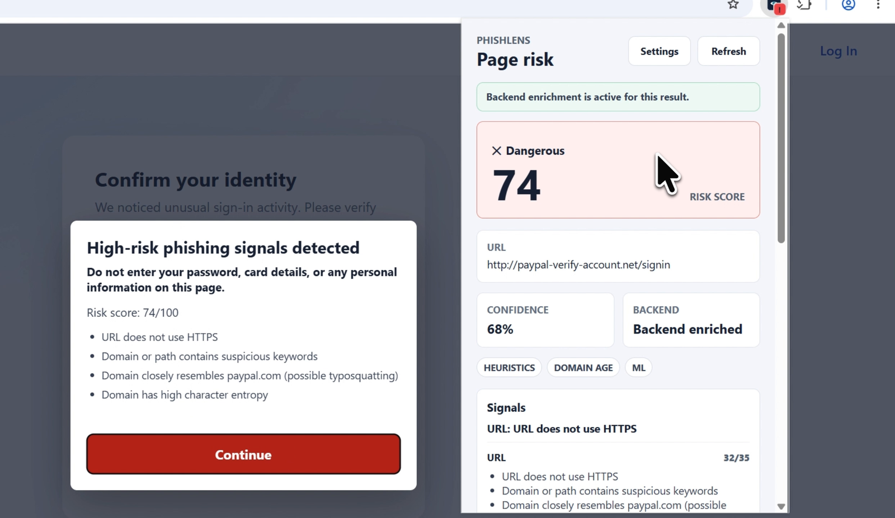
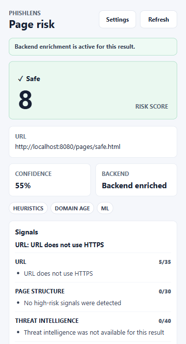
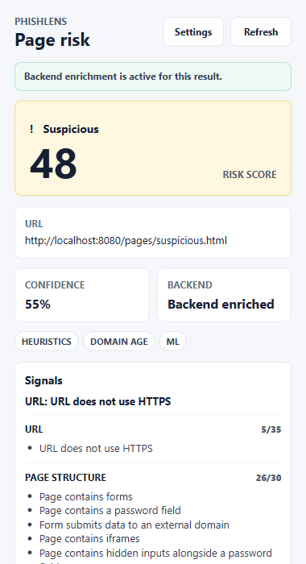
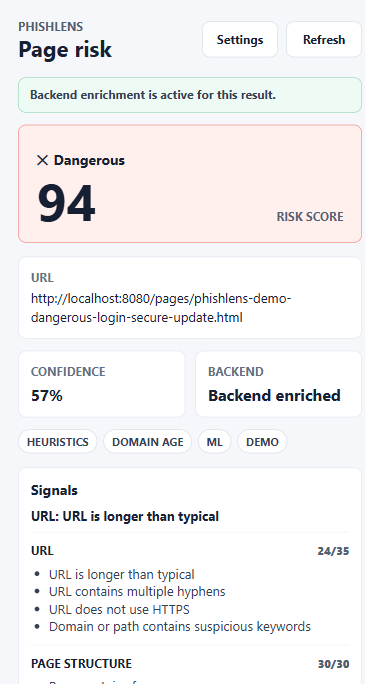
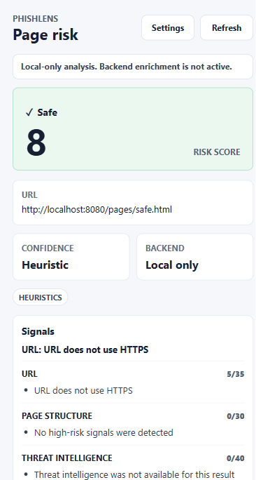
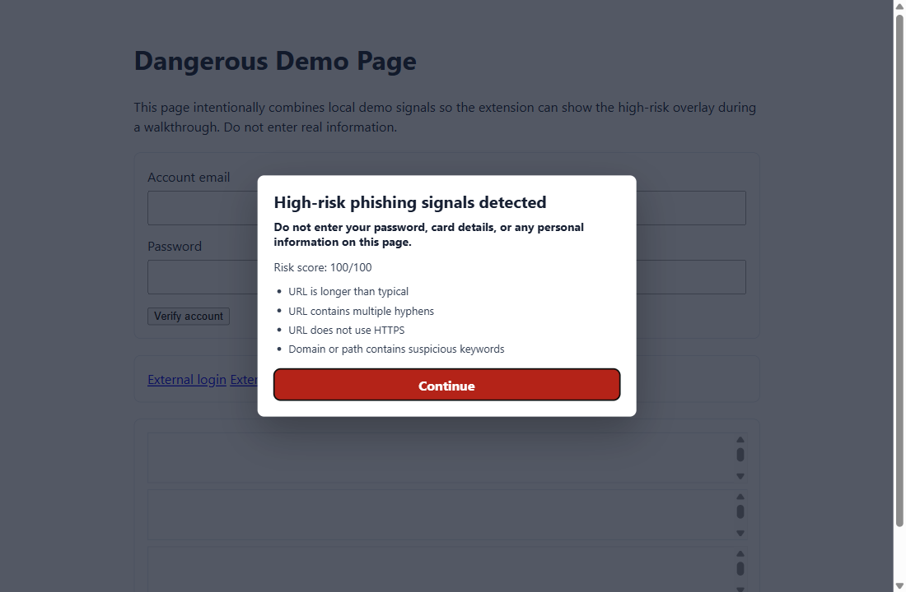

# PhishLens

[](https://github.com/JuanCardesa/PhishLens/actions/workflows/backend-ci.yml)
[](https://github.com/JuanCardesa/PhishLens/actions/workflows/extension-ci.yml)
[](https://github.com/JuanCardesa/PhishLens/actions/workflows/security-ci.yml)
[](https://codecov.io/gh/JuanCardesa/PhishLens)

**[Project site](https://juancardesa.github.io/PhishLens/)** · [Architecture](docs/architecture.md) · [Privacy policy](docs/privacy.md) · [Threat model](docs/threat-model.md) · [ML methodology](docs/ml-methodology.md) · [Demo script](docs/demo-script.md)

PhishLens is a defensive Chrome extension and FastAPI backend for explainable phishing risk analysis in real time.

It combines local URL heuristics, privacy-preserving DOM signals, optional PhishTank threat intelligence, backend-side TLS certificate inspection with Certificate Transparency lookups, RDAP domain-age checks, and an optional machine learning model. The project is built as a practical cybersecurity portfolio project with clear safety boundaries.



_PhishLens flagging a cloned PayPal login on a look-alike domain (`paypal-verify-account.net`) and explaining why, both in the popup and in the in-page warning. Both sites are local demo pages and the domain is not registered. The walkthrough below goes from the phishing email to the in-page warning:_


## Quick Start

```bash
# 1. Clone and set up the backend
git clone https://github.com/JuanCardesa/PhishLens.git && cd PhishLens
cp .env.example .env
python -m venv .venv && source .venv/bin/activate  # Windows: .venv\Scripts\activate
pip install -r backend/requirements-dev.txt

# 2. Start the backend and leave it running
uvicorn app.main:app --app-dir backend --reload

# 3. In a second terminal, from the repository root, build the extension
cd extension && npm install && npm run build

# 4. Load it in Chrome: chrome://extensions → Developer mode → Load unpacked → extension/dist
```

The extension also works without the backend; see [Development Setup](#development-setup) for Windows commands and [Local Demo](#local-demo) for pages that show each risk label. To rebuild the ML dataset and retrain the model: `python ml/datasets/build_dataset.py && python ml/train_model.py`.

## Features

- **Detection.** URL heuristics (typosquatting via Levenshtein, homograph/IDN attacks via a hand-written punycode decoder and confusable map, a brand's full domain hidden in subdomains) and privacy-preserving DOM signals (credential fields, external form actions, brand impersonation), scored into an explainable risk breakdown by URL, DOM, threat intelligence, TLS, domain age, and ML.
- **Backend enrichment (FastAPI).** `/analyze`, `/report`, `/health`; PhishTank threat intel, backend TLS + Certificate Transparency inspection, RDAP domain-age lookups — each with URL normalization, TTL caching, timeouts, and clean degradation when unavailable.
- **Extension (MV3).** A toolbar badge scored locally as each page loads, a React popup with a risk breakdown and feedback controls, an options page (backend URL, timeout, overlay), and a dismissible warning overlay for `dangerous` results. Works fully offline; the backend only enriches. Firefox support is experimental: the code and manifest are cross-browser, but it has not been click-tested in a real Firefox profile.
- **ML.** Training and evaluation pipeline on a real PhishTank + Tranco dataset, with SHAP per-prediction explanations and documented limitations (see [ML methodology](docs/ml-methodology.md)).
- **Quality & safety.** Unit tests plus a shared ext/backend scoring contract and a real-Chromium E2E smoke test; rate limiting, structured diagnostics with no sensitive payloads, host-only SQLite feedback, Docker, and CI (backend, extension, security, PR Guardian).

## Screenshots

The popup on the local demo pages (`demo/pages/`), captured from the built extension with `node extension/scripts/record-demo.mjs --docs`.

| Safe page | Suspicious page | Dangerous page | Backend unavailable |
|---|---|---|---|
|  |  |  |  |

With the backend unreachable, the safe page keeps the same score (8). The local score is the base the backend adds to, so the two only differ by what the backend finds.

The warning overlay on the dangerous demo page. That page also matches the localhost-only demo threat source (see [Local Demo](#local-demo)):



## Architecture

```text
Chrome page
  -> content script extracts non-sensitive DOM signals
  -> service worker scores the page locally and sets the toolbar badge
  -> popup computes the local score (URL + DOM points scaled to 0-100) and shows it
  -> popup optionally calls FastAPI /analyze
  -> backend starts from that same score and adds threat intel, TLS + Certificate
     Transparency, domain age, and an ML adjustment (-5 to +12)
  -> popup shows score, label, confidence, risk breakdown, and feedback controls
     (confidence is a percentage only when the ML model contributed, "Heuristic" otherwise)
  -> dangerous results can display a dismissible page overlay
  -> development diagnostics expose counters only
```

The extension never sends full HTML, form values, passwords, or typed emails. The backend receives only the current URL and technical DOM features.

## Stack

- Extension: TypeScript, React, Vite, Manifest V3, `webextension-polyfill` (for the experimental Firefox build).
- Backend: Python, FastAPI, Pydantic, httpx, scikit-learn, SHAP, pandas, joblib.
- Quality: pytest, ruff, mypy, Vitest, TypeScript checks, Playwright (real-Chromium E2E), GitHub Actions, Codecov.
- Runtime: Docker and Docker Compose.

## Development Setup

### Backend

**Linux / macOS**

```bash
python -m venv .venv
source .venv/bin/activate
pip install -r backend/requirements-dev.txt
uvicorn app.main:app --app-dir backend --reload
```

**Windows (PowerShell)**

```powershell
python -m venv .venv
.\.venv\Scripts\python.exe -m pip install -r backend/requirements-dev.txt
.\.venv\Scripts\python.exe -m uvicorn app.main:app --app-dir backend --reload
```

Health check:

```bash
curl http://localhost:8000/health
```

Interactive API documentation is available at `http://localhost:8000/docs` while the backend is running.

### Extension

```bash
cd extension
npm install
npm run build
```

Load `extension/dist` in Chrome:

1. Open `chrome://extensions`.
2. Enable Developer mode.
3. Select "Load unpacked".
4. Choose the `extension/dist` folder.

The extension works locally without the backend. When the backend is available at `http://localhost:8000`, the popup enriches the local result with backend analysis.

Extension settings are available from the popup settings button or Chrome extension details page. The default backend is `http://localhost:8000`.

## Tests

Backend (the same checks as Backend CI):

```bash
cd backend
pytest tests
ruff check app tests ../demo
mypy app
```

Extension (the same checks as Extension CI):

```bash
cd extension
npm run lint                        # tsc --noEmit
npm run test
npm run build
npx playwright install chromium     # first run only
npm run test:e2e                    # loads the built extension in real Chromium
```

Dependency audits (run by Security CI, not Extension CI):

```bash
cd extension && npm audit --audit-level=high
pip install pip-audit && pip-audit -r backend/requirements.txt
```

ML:

```bash
python ml/train_model.py
python ml/evaluate_model.py
python ml/evaluate_cv_metrics.py                 # the metrics in "ML Model Performance" below
python ml/evaluate_ml_adjustment.py --temporal   # evidence behind the ML score adjustment (downloads data)
```

Docker:

```bash
docker compose build
docker compose up backend
```

Review automation:

```bash
python scripts/ci/pr_guardian.py --all
```

Demo readiness:

```bash
python scripts/dev/check_demo.py
```

## Configuration

Copy `.env.example` to `.env` for local overrides. No real keys are committed.

| Variable | Default | Description |
|----------|---------|-------------|
| `PHISHTANK_API_KEY` | _(empty)_ | Optional PhishTank application key. Omit to skip threat intel. |
| `PHISHTANK_USER_AGENT` | `phishtank/phishlens-demo` | User-Agent sent with PhishTank requests (required by their API). |
| `PHISHLENS_ALLOWED_ORIGINS` | `http://localhost:5173` | Comma-separated CORS origins. Add `chrome-extension://*` only for local dev. |
| `PHISHLENS_CHROME_EXTENSION_IDS` | _(empty)_ | Comma-separated Chrome extension IDs for production CORS. |
| `PHISHLENS_ENABLE_THREAT_INTEL` | `true` | Enable/disable PhishTank lookups. |
| `PHISHLENS_ENABLE_TLS_ANALYSIS` | `true` | Enable/disable backend TLS certificate inspection. |
| `PHISHLENS_ENABLE_CT_LOG_LOOKUP` | `true` | Enable/disable Certificate Transparency log lookups (crt.sh) as an additional TLS risk signal. |
| `PHISHLENS_ENABLE_DOMAIN_AGE_LOOKUP` | `true` | Enable/disable RDAP domain-registration-age lookups. |
| `PHISHLENS_EXTERNAL_TIMEOUT_SECONDS` | `4.0` | Timeout for external backend enrichment calls such as PhishTank, RDAP, and crt.sh. |
| `PHISHLENS_MODEL_PATH` | `app/models/phishlens_model.joblib` | Path to a trained joblib model artifact. |
| `PHISHLENS_BRAND_DOMAINS_PATH` | `app/data/brand_domains.json` | Path to the curated brand-domain list used for typosquat/brand-impersonation detection. |
| `PHISHLENS_ENABLE_DIAGNOSTICS` | `true` | Expose aggregate counters at `GET /diagnostics`. |
| `PHISHLENS_DIAGNOSTICS_TOKEN` | _(empty)_ | When set, `GET /diagnostics` requires `X-Diagnostics-Token: <value>`. |
| `PHISHLENS_ENABLE_RATE_LIMITING` | `true` | Enable in-memory sliding-window rate limits. |
| `PHISHLENS_ANALYZE_RATE_LIMIT` | `60` | Max `/analyze` requests per window per IP. |
| `PHISHLENS_REPORT_RATE_LIMIT` | `20` | Max `/report` requests per window per IP. |
| `PHISHLENS_RATE_LIMIT_WINDOW_SECONDS` | `60` | Rate-limit window in seconds. |
| `PHISHLENS_BEHIND_PROXY` | `false` | Trust `X-Forwarded-For` when behind nginx / Caddy / ALB. |
| `PHISHLENS_FEEDBACK_DB_PATH` | `feedback.db` | SQLite path for feedback metadata. Set to `""` to disable. |
| `PHISHLENS_ENABLE_DEMO_THREAT_SOURCE` | `false` | Enable localhost-only dangerous demo signal. |

Extension settings:

- Backend URL: defaults to `http://localhost:8000`.
- Timeout: defaults to 2500 ms, clamped between 1000 ms and 10000 ms.
- Danger overlay: enabled by default and only shown for `dangerous` results.

## Ethical And Privacy Notice

PhishLens is defensive only. It must not collect credentials, typed emails, private form content, or full page HTML. It is a risk-assistance tool, not a phishing verdict authority. False positives and false negatives are expected, especially outside the limited dataset and signal coverage documented below.

## Local Demo

Run the backend, demo pages, and extension locally, each in its own terminal:

```powershell
# Terminal 1: backend with the localhost-only demo threat source
# (Linux / macOS: PHISHLENS_ENABLE_DEMO_THREAT_SOURCE=true uvicorn app.main:app --app-dir backend --reload)
$env:PHISHLENS_ENABLE_DEMO_THREAT_SOURCE="true"
.\.venv\Scripts\python.exe -m uvicorn app.main:app --app-dir backend --reload

# Terminal 2: demo pages on port 8080
python demo/serve_demo.py

# Terminal 3: build the extension
cd extension
npm run build
```

Load `extension/dist` in Chrome and visit:

- `http://localhost:8080/pages/safe.html` (Safe)
- `http://localhost:8080/pages/suspicious.html` (Suspicious)
- `http://localhost:8080/pages/phishlens-demo-dangerous-login-secure-update.html` (Dangerous)

Each page shows its label with or without the backend, and the E2E test checks all three. `PHISHLENS_ENABLE_DEMO_THREAT_SOURCE=true` adds a threat-intelligence match to the dangerous page so that category is visible without a PhishTank key; it only matches `localhost` URLs containing `phishlens-demo-dangerous`. Use `localhost` rather than `127.0.0.1`: the backend rejects private IP literals as an SSRF safeguard.

Package the extension:

```bash
cd extension
npm run package
```

The zip is written to `extension/release/`.

## ML Model Performance

**78.5% precision / 81.7% recall (5-fold stratified CV, N=1,200)** for the shipped
`RandomForestClassifier` on the committed PhishTank + Tranco dataset, with a **22% false-positive
rate**. This is a modest, URL-shape-only model. That is why it only nudges the rule-based score
(−5 to +12) and never decides a verdict on its own.

These numbers used to read 99.0% precision / 0.8% false positives. That was a dataset artifact:
599 of the 600 legitimate URLs had no subdomain, so the model learned "has a subdomain" as
phishing. Once legitimate URLs got realistic subdomains, and `www.` stopped counting as one,
precision fell to its honest level (see [Lessons Learned](#lessons-learned)).

| Metric | As-is (N=1,200) | Deduplicated (N=1,052) |
|--------|----------------:|-----------------------:|
| Precision | 0.785 | 0.786 |
| Recall | 0.817 | 0.823 |
| F1 | 0.801 | 0.804 |
| False-positive rate | 0.223 | 0.214 |
| ROC-AUC | 0.886 | 0.889 |
| Accuracy | 0.797 | 0.804 |
| Confusion matrix `[[TN, FP], [FN, TP]]` | `[[466, 134], [110, 490]]` | `[[423, 115], [91, 423]]` |

Reproduce with `python ml/evaluate_cv_metrics.py`. Phishing is the positive class, and the
dataset is balanced 50/50. The deduplicated column keeps one row per distinct feature vector: it
is the closest check for train/test leakage, because the CSV stores no URLs.

- **It does not hold up over time.** Trained on phishing more than two years old and tested on
  phishing from the last 14 days, it catches only 42% of new phishing (0.67 accuracy). URL shape
  ages quickly; domain age and DOM signals in the training data are the next step.
- **The score adjustment is sized to new phishing, not to the training set.** On unseen campaigns
  a high probability is still strong evidence, about 11 times more likely on phishing, so it adds
  +12. A low probability is weak evidence there, so it subtracts only 5
  (`python ml/evaluate_ml_adjustment.py --temporal`).
- **It is a URL-only model.** The dataset has no DOM features (they are always 0 in training), so
  the DOM values the extension sends at inference time are not something the model learned from.

[docs/ml-methodology.md](docs/ml-methodology.md) has the full methodology: class balance,
leakage, the URL-length and subdomain dataset biases that were found and fixed, the temporal
validation, and how the adjustment was sized.

## Limitations

- TLS analysis runs from the backend and may differ from what the browser sees behind proxies or TLS inspection.
- PhishTank checks require a user-provided API key and are rate limited.
- Feedback storage is intentionally minimal: hostname, labels, note presence, request ID, and timestamp only. It is not a replacement for a reviewed training dataset.
- Diagnostics are development counters only and should not be treated as production telemetry.
- In-memory rate limiting is process-local and resets when the backend restarts.
- Every real login page scores some page-structure points: a form, a password field, and hidden
  inputs are what a credential page is, legitimate or not. The real PayPal sign-in page gets about
  16 of 30 there (25 once scaled), which stays Safe on its own but leaves less room for other
  signals.
- The ML model is URL-shape only and trained on 1,200 rows. It adds +12 to 6.7% of legitimate
  URLs in cross-validation (2.3% on newer data), and on new phishing it subtracts 5 points about a
  third of the time (see [ML Model Performance](#ml-model-performance)).
- The current build prioritizes explainability and safe defaults over coverage.

## Lessons Learned

A few things found during a deliberate self-audit of this project, kept here instead of
quietly fixed and forgotten, because how a bug was found and corrected is often more
informative than the fact that the code is now clean:

- **The content script and danger overlay were silently broken in real Chrome, while every automated check stayed green.** Adding Firefox support introduced an ES `import` statement into two files that execute as classic, non-module scripts (MV3 content scripts and `chrome.scripting.executeScript`-injected files can't be modules). `tsc`, `vitest`, and `vite build` all passed, because none of them load the bundle in an actual browser — Vitest mocks the module graph, and Vite's build doesn't check runtime module-format compatibility. Found by recording this README's original demo GIF with a real Playwright + Chromium session instead of a screen recording tool, which surfaced "Could not establish connection" the moment the popup tried to collect DOM features. Fixed by splitting the build into two Rollup passes — ES modules for popup/options/the service worker, IIFE for the content script and overlay. The lesson: a green test suite proves the code you tested, not the environment you didn't.
- **A 95% ML accuracy number was hiding a trivial shortcut.** The training dataset built
  legitimate URLs as bare domain roots (`https://example.com/`) while phishing URLs from
  PhishTank carry real paths, so `url_length` alone separated the two classes almost
  perfectly — the model was learning "has a path" instead of phishing patterns. Fixed by
  adding realistic paths to legitimate URLs; honest accuracy dropped to ~91% CV. Detailed
  in [docs/ml-methodology.md](docs/ml-methodology.md#known-limitation-found-and-fixed-url-length-separability-bias).
- **The same fix left a second shortcut next to the first.** Legitimate URLs got realistic
  paths but kept bare hosts, so 599 of 600 had no subdomain and the model learned "has a
  subdomain" as phishing. It showed up as a real false positive while recording the demo: the
  real PayPal sign-in page scored Suspicious 36, and SHAP named the cause, "number of subdomains,
  number of dots". The `www.` prefix alone swung the ML adjustment from −10 to +20. Fixed by not
  counting `www` as a subdomain and by giving legitimate URLs realistic hosts; the same PayPal
  page now scores Safe 20 (page structure 16/30, ML −5). Precision fell from
  99.0% to 78.5%, and a temporal check that had looked reassuring (0.91) fell to 0.67. The
  near-perfect numbers had been measuring the dataset, not phishing. Detailed in
  [docs/ml-methodology.md](docs/ml-methodology.md#known-limitation-found-and-fixed-subdomain-separability-bias).
- **The offline fallback's "dangerous" label was effectively unreachable.** It needed
  ~92% of its own maximum possible score because the threshold (60) was hand-picked
  against a smaller scale than the backend's (70) without reconciling the two. Fixed by
  scaling the local score onto the backend's 0-100 range before applying the same
  threshold.
- **That fix only scaled one side, so the two scores disagreed.** The backend kept adding URL
  and DOM points unscaled. The cloned PayPal login in the demo recording read Dangerous 95 in the
  popup and then 74 once the backend answered, and without the ML's +12 the backend would have
  called it Suspicious 62: on the backend, URL and DOM evidence alone topped out at 65. Found
  while recording the demo video, not by any test, because each side's tests only checked its own
  formula. Fixed by having the backend start from the same scaled score and add its own
  categories on top. The shared scoring contract now asserts that combined score on both sides.
- **Backtesting the URL heuristic weights surfaced their own blind spot.** Without
  typosquat/homograph signals (which need the raw domain — not stored in the dataset for
  privacy), the remaining numeric-only heuristics never reach the scoring cap on this
  dataset. That's not a miscalibration; it confirms typosquat/homograph detection carries
  most of the URL category's weight in practice. See
  [docs/ml-methodology.md](docs/ml-methodology.md#heuristic-engine-backtest-rule-based-scoring-no-ml).
- **A new external call (RDAP) silently exceeded the extension's request timeout.**
  Adding domain-age lookups didn't itself cause this — profiling showed the real cost was
  a one-time, multi-second `sklearn` import triggered by lazily unpickling the ML model on
  the first request, which also blocked the event loop for concurrent requests. Fixed by
  warming up the model from a FastAPI `lifespan` handler at startup; first-request latency
  dropped from ~5.5s to ~1.4s.
- **The heuristic-only "confidence" number is overconfident, not just unproven.** A
  reliability diagram against the committed dataset showed every confidence bin with more
  than one row sitting below the perfectly-calibrated line, and the bin holding 96% of rows (confidence ≈ 0.90)
  was only ~52% accurate — barely better than guessing. Not "fixed" with a quick correction
  factor in this round, because calibrating against a dataset that can't exercise
  typosquat/homograph/DOM/TLS/domain-age/threat-intel signals would just calibrate to this
  benchmark's blind spots. Instead, the popup stopped presenting it as a probability: when the
  ML model did not contribute, it shows "Heuristic" (with a tooltip explaining why) rather than a
  percentage, and the copied report says "heuristic (not a calibrated probability)". See
  [docs/ml-methodology.md](docs/ml-methodology.md#heuristic-only-confidence-calibration-reliability-diagram).

## Roadmap

See [docs/roadmap.md](docs/roadmap.md).

## Review And Release Process

PhishLens uses deterministic review gates instead of relying on a single reviewer. See [docs/review-methodology.md](docs/review-methodology.md) and [docs/release-process.md](docs/release-process.md).

Publication preparation lives in [docs/chrome-web-store.md](docs/chrome-web-store.md), with permission rationale in [docs/permissions.md](docs/permissions.md).
