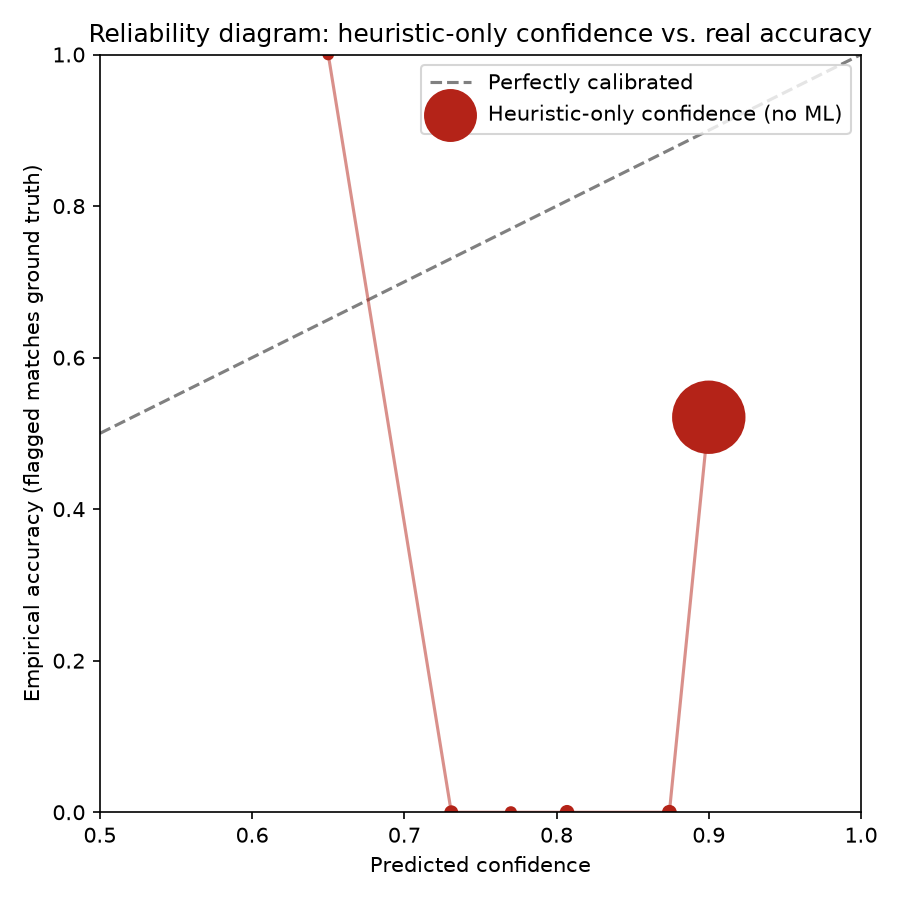

# ML Methodology

## Objective

The model estimates whether a page has phishing-like risk signals from numeric URL and DOM features. It is an assistive signal in a hybrid scoring system, not a standalone verdict.

## Datasets

### Real dataset (preferred)

`ml/datasets/real_phishing_urls.csv` — built by `ml/datasets/build_dataset.py` and committed
to the repository (it contains only the 16 numeric features and a label, never raw URLs or
domains, so it carries no privacy risk).

| Source | Content | Size |
|--------|---------|------|
| [PhishTank public data dump](https://data.phishtank.com/data/online-valid.csv.gz) | Verified phishing URLs (`verified=yes`) | 600 rows |
| [Tranco top-1M list](https://tranco-list.eu) | Legitimate domains (top 50 000 sampled), given realistic hosts and paths (see the two bias fixes below) | 600 rows |

To rebuild the dataset from a fresh PhishTank/Tranco snapshot (requires internet access, ~1–2 min):

```bash
cd ml
python datasets/build_dataset.py
python train_model.py
```

`build_dataset.py` imports the backend URL feature extractor, so the 10 URL-derived training
features are generated by the same code path used during inference. `train_model.py` stores the
dataset name and SHA-256 in the joblib artifact, writes a local copy under `ml/models/`, and
copies the runtime artifact to `backend/app/models/phishlens_model.joblib` for backend packaging.
`evaluate_model.py` refuses to evaluate if the artifact metadata does not match the current CSV.

**Limitation:** DOM features (`has_password_field`, `num_forms`, etc.) are set to `0` for all
URL-only rows because they require a live browser session to collect. The model therefore relies
entirely on URL-derived signals when evaluated against this dataset. Real-world inference still
uses DOM features from the extension's content script — see
[Train/inference feature mismatch](#traininference-feature-mismatch-important-caveat-on-the-numbers-above)
for why this means the metrics below describe a URL-only model, not the full production vector.

### Known limitation found and fixed: URL-length separability bias

An earlier version of `build_dataset.py` built legitimate rows as bare Tranco domain
roots (`https://example.com/`) while PhishTank phishing URLs are real captured pages that
almost always carry a path or query string. A direct audit of the committed CSV showed
this made the classes nearly separable on `url_length` alone — legitimate rows averaged
~21 characters, phishing rows ~48 — meaning the model could score well by detecting
"has a path" rather than learning phishing-specific patterns. That would have missed
phishing hosted at a clean root domain and false-flagged legitimate pages with long,
parameterized URLs (e.g. SSO/OAuth callbacks).

Fix: `build_dataset.py` now appends a realistic path/query (`/login`, `/account/settings`,
`/search?q=...`, etc., see `REALISTIC_PATH_TEMPLATES`) to ~80% of legitimate URLs before
feature extraction, with the rest left as roots to reflect real traffic. This narrowed the
mean url_length gap (legitimate ~38.5 vs. phishing ~49.3 characters after the fix on the June
2026 snapshot, ~42.1 vs. ~47.6 on the current one, with overlapping ranges) and is now guarded by
`backend/tests/test_ml_dataset_builder.py::test_real_dataset_url_length_is_not_trivially_separable_by_class`,
which fails the build if the distributions stop overlapping.

### Known limitation found and fixed: subdomain separability bias

The URL-length fix gave legitimate rows realistic paths but left their hosts as bare Tranco
domains (Tranco lists registrable domains). PhishTank URLs keep whatever host the phishing page
used, so `num_subdomains`, and `num_dots` with it, became a class label in disguise: in the
committed CSV, **599 of 600 legitimate rows had no subdomain**, against 128 of 600 phishing rows.
The model learned "has a subdomain" as phishing. That never showed up in the metrics, because the
dataset contained no legitimate page on a subdomain, but it is most of real traffic:

| URL (URL features only) | Old model | Fixed model |
|---|---:|---:|
| `https://www.paypal.com/signin` | +20 (p = 0.96) | −5 (p = 0.27) |
| `https://paypal.com/signin` | −10 (p = 0.18) | −5 (p = 0.27) |
| `https://accounts.google.com/signin` | +20 (p = 0.96) | −5 (p = 0.33) |
| `https://www.github.com/login` | +20 (p = 0.95) | −5 (p = 0.29) |

The first row is the false positive that surfaced while recording the demo: the real PayPal
sign-in page scored Suspicious 36, with SHAP citing "number of subdomains" and "number of dots".

Two fixes:

- **`www` is not a subdomain.** `feature_extractor.py` and `url-features.ts` no longer count a
  leading `www` label as a subdomain or its dot as a dot. It is a naming convention, not
  structure an attacker chose.
- **Legitimate URLs get realistic hosts.** `build_dataset.py` gives 35% of legitimate URLs a
  common service subdomain (`accounts.`, `mail.`, `docs.`, `support.`, … see
  `REALISTIC_SUBDOMAINS`) and 35% a `www.` prefix, and leaves the rest bare. This is the same
  approach as the path fix above. After rebuilding the dataset (2026-09-29 snapshot), 192 of
  600 legitimate rows and 404 of 600 phishing rows have a subdomain: the feature still carries
  signal, but no longer decides the class alone.
  `test_real_dataset_num_subdomains_is_not_a_class_label` fails if that share falls below 20%.

The cost is that the headline metrics fell sharply (next section). Most of the old model's
near-perfect precision came from this shortcut, not from phishing patterns.

### Measured performance (real dataset, 1200 rows, post-fix)

`train_model.py` reports only CV **accuracy**, which is a weak headline for a detector because it
hides the precision/recall trade-off. `ml/evaluate_cv_metrics.py` re-runs the same model
(`RandomForestClassifier`, identical hyperparameters) under stratified 5-fold cross-validation and
reports the full phishing metric set. Phishing is the positive class; the confusion matrix and FPR
are aggregated out-of-fold via `cross_val_predict` (every row predicted exactly once), so they are
a true aggregate, not an average of per-fold matrices.

```bash
cd ml
python evaluate_cv_metrics.py
```

| Metric | As-is (N=1,200) | Leakage-corrected (N=1,052) |
|--------|----------------:|--------------------------:|
| Class balance (phishing / legit) | 600 / 600 (50.0%) | 514 / 538 (48.9%) |
| Precision | 0.785 | 0.786 |
| Recall | 0.817 | 0.823 |
| F1 | 0.801 | 0.804 |
| False-positive rate | 0.223 | 0.214 |
| ROC-AUC | 0.886 | 0.889 |
| Accuracy | 0.797 | 0.804 |
| Confusion matrix `[[TN, FP], [FN, TP]]` | `[[466, 134], [110, 490]]` | `[[423, 115], [91, 423]]` |

**Headline: 78.5% precision / 81.7% recall (5-fold stratified CV, N=1,200).** Before the subdomain
fix above, the same evaluation reported 99.0% precision / 82.2% recall and a false-positive rate
of 0.8%. Recall barely moved, but precision collapsed. The old model rarely raised a false alarm on
its own dataset because that dataset had no legitimate page on a subdomain. On this dataset, which
has them, it wrongly flags more than 1 legitimate URL in 5. That is the honest performance of a
URL-shape-only model, and why the ML signal is a bounded adjustment (−10 to +20) on top of the
rule-based score, not a verdict. The dataset is balanced 50/50 by construction, so accuracy (0.797)
is not distorted by class imbalance here, but it still hides where the errors are.

**Leakage check.** The committed CSV stores only numeric features and a label, never domains (see
above), so domain-level leakage (same host in train and test) cannot be verified from the file. The
closest observable proxy is duplicate feature vectors: **245 of the 1,200 rows belong to a group of
identical rows** (1,052 distinct feature vectors), because PhishTank captures many paths on one host
and Tranco roots collapse to identical numeric rows, so a random k-fold split can place identical
vectors in both train and test. The "Leakage-corrected" column removes that path to leakage by
deduplicating to one row per distinct feature vector. The corrected numbers are slightly *higher*,
so the duplicates are not inflating the headline. Both columns are reported for transparency; the
as-is column is the conservative figure.

`train_model.py`'s single 33% hold-out (396 rows) agrees: 0.82 accuracy, precision 0.83 / recall
0.81 / F1 0.82 for legitimate URLs and 0.81 / 0.83 / 0.82 for phishing, confusion matrix
`[[160, 38], [33, 165]]` (rows/cols = legitimate, phishing). The 5-fold CV table supersedes it as
the primary estimate because it uses every row for both training and evaluation and reports FPR and
ROC-AUC.

**What the ML adjustment does in practice.** Mapping each out-of-fold probability through
`_adjustment_from_probability` shows how often the model moves a page's score:

| ML adjustment | Legitimate rows | Phishing rows |
|---:|---:|---:|
| −10 | 30.2% | 1.3% |
| −5 | 30.3% | 8.3% |
| 0 | 32.8% | 29.8% |
| +12 | 6.3% | 43.7% |
| +20 | 0.3% | 16.8% |

So about 1 legitimate URL in 15 gets +12 or +20. Before the fix, the table looked far cleaner on the
dataset (0.2% of legitimate rows), but every legitimate page on a subdomain got +20 in real use.

- Top feature importances: `domain_entropy`, `num_dots`, `url_length`, `num_subdomains`,
  `uses_https`

### Train/inference feature mismatch (important caveat on the numbers above)

All the metrics above are computed on the 10 URL-derived features only — the 6 DOM
columns (`has_password_field`, `num_forms`, `external_form_action`, `num_iframes`,
`external_links_ratio`, `has_hidden_inputs`) are hardcoded to `0` for every row in
`real_phishing_urls.csv` (`ml/datasets/build_dataset.py`, `FEATURE_COLUMNS`/
`extract_url_features`), because building the dataset never opens a browser. The trained
`RandomForestClassifier` therefore never saw real variation in those 6 columns during
training or cross-validation.

At inference time, `backend/app/services/ml_service.py::_feature_values` builds the same
16-feature vector but fills the DOM columns with **real** values collected by the
extension's content script (`extension/src/content/dom-analyzer.ts`). This means:

- The CV and hold-out figures above describe a model evaluated on a
  URL-only vector. They say nothing about how the model behaves on the full
  16-feature vector it actually receives in production, because that combination
  (real URL features + real DOM features) was never present during training or
  evaluation.
- Any split the trees learned on a DOM column (if `RandomForest` happened to use one,
  e.g. `has_password_field`) was learned from a constant value of `0` — it cannot encode
  a meaningful relationship between that feature and the label, so in practice those
  features are inert at inference too. The risk is not "the model overreacts to DOM
  features" but "the model is structurally unable to use them," which is a silent
  capability gap rather than a correctness bug: `MLResult.top_factors` (SHAP) has never
  been observed citing a DOM feature in practice, consistent with this.
- This was not fixed by retraining on synthetic DOM values, because synthetic
  password-field/iframe/form data fabricated without a real page would be a second,
  unvalidated assumption layered on top of the first — it would make the metrics
  *look* more complete without actually testing anything real. The honest fix is the one
  applied elsewhere in this project: keep DOM signals in the **rule-based** scoring layer
  (`scoring_service._score_dom`, with its own explicit point weights and tests) where
  their effect is transparent and tested, and treat the ML adjustment as a URL-only
  signal until a labeled dataset with real captured DOM snapshots exists.

### Temporal validation (train on older phishing, test on newer)

The cross-validation and hold-out numbers above only prove the model generalizes
*within one snapshot* — they say nothing about whether it still works against phishing
campaigns it has never seen. `ml/evaluate_temporal_drift.py` answers that directly using
PhishTank's `submission_time` field (present in the public dump, range observed:
2011-02-18 to today):

- **Train**: phishing URLs submitted more than 2 years ago + a Tranco top-50k legitimate
  sample (same range as the production dataset).
- **Test**: phishing URLs submitted in the last 14 days (campaigns the model could not
  possibly have seen) + a *disjoint* Tranco rank window (50 001–100 000) for legitimate
  URLs. Both sides get the same `realistic_legit_url` host and path enrichment as the
  production dataset.
- Trains a fresh, throwaway `RandomForestClassifier` (same hyperparameters as
  `train_model.py`) on the old split only, and evaluates on the new split — it never
  touches the committed dataset or the production model artifact.

Result from a real run (cutoffs: train < 2024-09-29, test > 2026-09-15; 300 rows per class
on each side): **0.67 accuracy**, precision 0.84 / recall **0.42** for phishing, precision
0.61 / recall 0.92 for legitimate, confusion matrix `[[276, 24], [175, 125]]`. The model
trained on old campaigns misses more than half of new phishing.

This reverses the earlier conclusion. The June 2026 run reported 0.91 accuracy (phishing
recall 0.85) and read it as "generalizes to campaigns two years later", but that run still
had bare legitimate hosts. Re-running today's data without the realistic hosts gives 0.83
accuracy (phishing recall 0.68). The drop has two parts:

| Temporal run | Accuracy | Phishing recall |
|---|---:|---:|
| June 2026 snapshot, bare legitimate hosts | 0.91 | 0.85 |
| September 2026 snapshot, bare legitimate hosts | 0.83 | 0.68 |
| September 2026 snapshot, realistic hosts (current) | **0.67** | **0.42** |

Newer campaigns look less like the old ones (first step), and most of what looked like
generalization was the subdomain shortcut, which every snapshot shared (second step). URL shape
alone is a weak, fast-aging signal. The next gains need other features: domain age, DOM
signals in the training data, and regular retraining (see `docs/roadmap.md`).

**Limitation, stated plainly:** Tranco has no time axis (it's always "current rank now"),
so only the phishing side is genuinely split by time; the legitimate side is split by a
disjoint rank window as the closest available proxy for "different sample, not seen
during training." This is documented here instead of being described as a full temporal
split on both classes.

CV accuracy went from 0.954 to 0.907 when the url_length shortcut was removed, and from 0.907
to 0.797 when the subdomain shortcut was removed (with a new snapshot, rebuilt 2026-09-29).
Each fix lowered the number and made it more honest: less of it comes from how the dataset was
assembled. These numbers reflect URL-only features
(DOM features are 0 for every row, per the limitation above) and PhishTank/Tranco's snapshot
at build time — re-running `build_dataset.py` will pull a different sample and produce
slightly different numbers. Treat this as a baseline, not a fixed benchmark.

### Synthetic demo dataset (fallback)

`ml/datasets/demo_phishing_urls.csv` is a small synthetic set used only to validate the
training pipeline when the real dataset has not been built yet. Do not treat metrics from
this dataset as production evidence.

`train_model.py` auto-detects which dataset is present and logs which one it used.

## Model Metrics

Run the full pipeline to generate metrics:

```bash
cd ml
python train_model.py   # prints CV accuracy, classification report, feature importances
python evaluate_model.py  # re-evaluates the saved artifact
```

Metrics to track: accuracy, precision, recall, F1-score, AUC-ROC, confusion matrix.
Prioritize recall for phishing URLs while keeping the false-positive rate on legitimate
pages (e.g. bank login pages) below 10 %.

## Features

Initial features mirror the backend and extension:

- URL length, dots, hyphens, IP domain, `@`, HTTPS, subdomain count.
- Suspicious keyword count, punycode, domain entropy.
- DOM password field, form count, external form action, iframe count, external link ratio, hidden inputs.

## Models

- Baseline: Logistic Regression.
- Initial primary model: RandomForestClassifier.

The training script stores both the primary model and baseline metadata in a joblib artifact.
The runtime artifact committed for the backend lives at `backend/app/models/phishlens_model.joblib`.

## Per-Prediction Explainability (SHAP)

`train_model.py` already prints global `feature_importances_` (which features matter
most across the whole training set), but that doesn't say which features drove the
score for *this specific URL*. `backend/app/services/ml_service.py` builds a
`shap.TreeExplainer` for the loaded RandomForest once (cached alongside the model) and
computes per-prediction SHAP values at inference time, surfacing the top 2 contributing
features as `MLResult.top_factors`. When the ML adjustment is non-zero,
`scoring_service._ml_reasons` appends a `"Top ML factors: ..."` reason listing them.

This is genuinely per-instance — two URLs that both increase risk can cite different
top factors (e.g. one driven by `domain character entropy`, another by `number of
subdomains`). If SHAP can't explain a given model (e.g. the model type doesn't support
`TreeExplainer`, or shape mismatch), `top_factors` falls back to an empty tuple and the
rest of the scoring pipeline is unaffected — explainability is best-effort, never a
prediction blocker.

## Heuristic-only confidence calibration (reliability diagram)

`scoring_service._confidence()` falls back to `0.55 + abs(score - 50) / 100`
(capped at 0.9) whenever the ML model is unavailable — a linear proxy for "how
far this result is from the middle of the score range," explicitly never
described as a calibrated probability. `ml/evaluate_confidence_calibration.py`
checks exactly how far off it is from one, by reconstructing the URL-only
heuristic score for every row of the committed dataset (same reconstruction
limits as the heuristic backtest above: no typosquat/homograph, DOM features
fixed at 0), computing `_confidence()` on it, and binning predicted confidence
against the empirical accuracy of the resulting safe/not-safe call:

```bash
cd ml
python evaluate_confidence_calibration.py
```

Result from a run against the committed dataset (1200 rows):

| Confidence bin | Mean confidence | Empirical accuracy | n |
|---|---:|---:|---:|
| [0.65, 0.70) | 0.650 | 1.000 | 1 |
| [0.70, 0.75) | 0.731 | 0.000 | 12 |
| [0.75, 0.80) | 0.770 | 0.000 | 3 |
| [0.80, 0.85) | 0.807 | 0.000 | 16 |
| [0.85, 0.90) | 0.874 | 0.000 | 17 |
| [0.90, 0.95) | 0.900 | 0.521 | 1151 |

Mean calibration error (weighted `|confidence - accuracy|` across bins): **0.396** (0.397 on the
dataset before the 2026-09-29 rebuild).



**Finding, stated plainly:** the heuristic-only confidence is not just "uncalibrated" in
the harmless sense of being a rough proxy — on this dataset it is systematically
*overconfident*. Every bin with more than one row sits below the diagonal, and the bin holding 96% of the rows
(confidence ≈ 0.90) is only ~52% accurate, barely better than a coin flip. This was not
"fixed" by adding a counter-bias or a temperature-scaling correction in this round,
because doing so against a dataset that itself can't exercise typosquat/homograph/DOM/
TLS/domain-age/threat-intel signals would calibrate the formula to this benchmark's blind
spots, not to real-world accuracy. The honest takeaway is narrower: treat the heuristic-only
confidence number as a tie-breaker between results, not as a probability, until it can be
calibrated against a dataset that exercises the full signal set the live backend actually uses.

## Metrics

Track accuracy, precision, recall, F1-score, and confusion matrix. In future datasets, prioritize recall for malicious URLs while controlling false positives for normal login and banking pages.

## Heuristic engine backtest (rule-based scoring, no ML)

`ml/evaluate_heuristics.py` backtests `_score_url`'s point weights
(`backend/app/services/scoring_service.py`) against the committed
`real_phishing_urls.csv`, independent of the ML model.

**Limitation:** the committed CSV does not store raw domains (privacy decision, see
above), so this backtest can only reconstruct the columns present in the file —
`url_length`, `num_dots`, `num_hyphens`, `uses_ip_domain`, `has_at_symbol`,
`uses_https`, `num_subdomains`, `suspicious_keyword_count`, `uses_punycode`,
`domain_entropy`. It **cannot** backtest typosquatting, homograph, or mixed-script
detection, which require the actual domain string and contribute the largest single
point values in `_score_url` (+14 to +16). Treat these numbers as a partial backtest
of the numeric-only weights, not a full evaluation of the URL heuristic engine.

Result from a run against the 1200-row dataset (`python ml/evaluate_heuristics.py`):

| Score threshold | Precision | Recall | F1 |
|---|---|---|---|
| ≥ 1 | 0.631 | 0.373 | 0.469 |
| ≥ 8 | 0.967 | 0.147 | 0.255 |
| ≥ 14 | 1.000 | 0.053 | 0.101 |
| ≥ 20 | 1.000 | 0.022 | 0.042 |
| ≥ 30 | 0.000 | 0.000 | 0.000 |

0% of rows in either class reach the 35-point `URL_SCORE_CAP` using only these
numeric signals. This is expected, not a bug: it confirms that typosquatting/homograph
detection (excluded from this backtest) carries most of the weight needed to reach the
cap in practice — the numeric-only signals are a low-recall, high-precision secondary
layer, not the primary URL-based detector. No weights were changed based on this
result; it is documented here as a baseline for future backtesting once a privacy-safe
way to include domain-string-dependent features is found (e.g. backtesting in-memory
against freshly fetched URLs without persisting them to disk).

## Future Data Sources

Use legally available, documented datasets only. Candidate sources include public phishing URL feeds, benign URL corpora, internally generated safe examples, and browser telemetry only if collected with explicit consent and strict privacy controls.

## Limitations

Phishing behavior changes quickly. URL-only and DOM-only signals can be bypassed. The model needs regular retraining, drift checks, and careful review of false positives.
